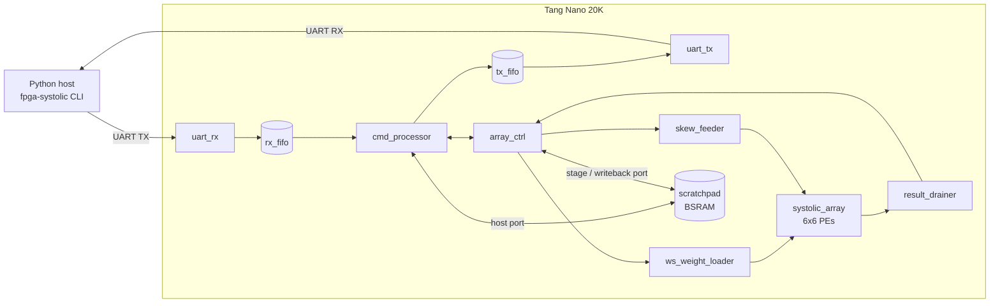

# MOSAIC

**M**atrix **O**perations, **S**ystolic **A**rray, **I**nterchangeable **C**ompute

[](LICENSE)
[](https://github.com/yJulian/mosaic/actions/workflows/ci.yml)

A 6x6 int8x8->int32 systolic array accelerator for the Sipeed Tang Nano
20K, switchable between weight-stationary and output-stationary GEMM
dataflows, controlled over a framed UART protocol from a Python host.
Simulation runs on the open-source GHDL; the bitstream is built and
programmed with Gowin's own EDA (headless, no GUI, via `gw_sh` +
`programmer_cli` -- see [Status](#status) and `docs/bringup.md` for why).



*(See [`docs/architecture.md`](docs/architecture.md) for the full
dataflow explanation and an FSM/PE-interconnect diagram.)*

## Status

- **RTL + simulation: complete and fully verified.** Nine testbenches
  cover every module up through a full-chip test (90 checks) driven
  purely over simulated UART, exactly as the real host driver talks to
  it. Run them all with `scripts/sim_all.sh` (or `make sim-all`).
- **Hardware bring-up: done, on a real Tang Nano 20K.** Built and
  SRAM-programmed via the Gowin toolchain (`scripts/build.sh` +
  `scripts/program.sh`), and the full bring-up sequence passes: UART
  ping, and both WS and OS compute round trips verified against numpy
  on real silicon. Getting there took finding and fixing one real
  hardware bug (a reset input that read stuck on the actual board) --
  see [`docs/bringup.md`](docs/bringup.md) for the full trail.
- The project targets the Tang Nano 20K (GW2AR-LV18QN88C8/I7) rather
  than the smaller Tang Nano 9K: the full design needs more LUTs/DSPs
  than the 9K has. See [`docs/architecture.md`](docs/architecture.md)
  for the resource numbers.

## Repository layout

```
rtl/            VHDL sources
  common/         shared packages (types, protocol constants, memory map)
  pe/             single processing element
  array/          6x6 PE grid + array controller FSM
  mem/            BSRAM scratchpad
  feeder/         weight/activation staging + result drain/writeback
  uart/           UART rx/tx + generic FIFO
  ctrl/           CRC-8, UART protocol parser/dispatcher
  top/            top-level integration, reset synchronizer
sim/            GHDL testbenches (+ a UART bus-functional-model package)
constraints/    Pin constraints (.cst) for the Gowin toolchain
examples/       minimal blinky bring-up smoke test
scripts/        build.sh / sim.sh / sim_all.sh / program.sh
gowin/          gw_sh Tcl scripts (synthesis/P&R/bitstream) + bring-up debug bitstreams
python/         host driver + CLI (`fpga-systolic`)
docs/           architecture.md, protocol.md, memory_map.md, bringup.md
```

## Quick start

### Simulate everything

```bash
scripts/sim_all.sh          # or: make sim-all
scripts/sim.sh tb_top --wave   # single testbench + waveform dump
```

### Build the bitstream

```bash
scripts/build.sh          # synthesis -> place&route -> gowin/proj/mosaic/impl/pnr/mosaic.fs
```

Needs a Gowin EDA install (the free Education edition works); the
script auto-detects it under `C:\Gowin\...` or set `GOWIN_DIR`
explicitly -- see `scripts/common_gowin.sh`.

### Host driver

```bash
cd python
python3 -m venv .venv && .venv/bin/pip install -e ".[dev]"
.venv/bin/pytest tests/ -v                      # host-only, no hardware needed

.venv/bin/fpga-systolic ping -p /dev/ttyUSB0
.venv/bin/fpga-systolic run -p /dev/ttyUSB0 --mode ws --random --verify
```

### Hardware (see docs/bringup.md for the full sequence)

```bash
scripts/program.sh                  # SRAM, volatile (default)
scripts/program.sh --flash          # embFlash, persistent

cd python && .venv/bin/fpga-systolic ping -p <port> -b 1500000
.venv/bin/fpga-systolic run -p <port> --mode ws --random --verify
```

## Documentation

- [`docs/architecture.md`](docs/architecture.md) -- dataflow design (WS/OS),
  toolchain findings, resource/capacity story
- [`docs/protocol.md`](docs/protocol.md) -- UART frame format, opcode table
- [`docs/memory_map.md`](docs/memory_map.md) -- scratchpad BSRAM layout
- [`docs/bringup.md`](docs/bringup.md) -- hardware bring-up checklist
