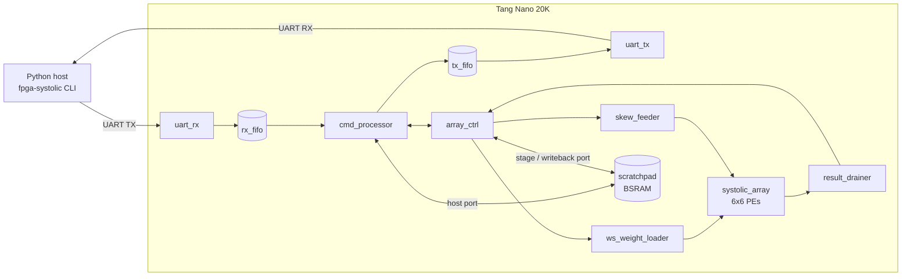

# MOSAIC

**M**atrix **O**perations, **S**ystolic **A**rray, **I**nterchangeable **C**ompute

A 6x6 int8x8->int32 systolic array accelerator for the Sipeed Tang Nano
20K, switchable between weight-stationary and output-stationary GEMM
dataflows, controlled over a framed UART protocol from a Python host.
Built end-to-end with the open-source `oss-cad-suite` toolchain
(yosys + GHDL for VHDL, nextpnr-himbaechel, gowin_pack, openFPGALoader)
for synthesis and simulation, with Gowin's free EDA tool bridging the
one remaining gap (place&route for this specific device -- see
[Status](#status) below).



*(See [`docs/architecture.md`](docs/architecture.md) for the full
dataflow explanation and an FSM/PE-interconnect diagram.)*

## Status

- **RTL + simulation: complete and fully verified.** Nine testbenches
  cover every module up through a full-chip test (90 checks) driven
  purely over simulated UART, exactly as the real host driver talks to
  it. Run them all with `scripts/sim_all.sh` (or `make sim-all`).
- **Hardware bring-up: not yet done.** This environment has neither a
  Tang Nano 20K board nor Gowin EDA installed, so nothing past
  simulation and synthesis-level linting has been run for real. See
  [`docs/bringup.md`](docs/bringup.md) for the exact next steps and
  what to double-check (pin assignments in particular) before the
  first program attempt.
- The project targets the Tang Nano 20K (GW1NSR-18C) rather than the
  smaller Tang Nano 9K: the full design needs more LUTs/DSPs than the
  9K has. See [`docs/architecture.md`](docs/architecture.md) for the
  resource numbers and the toolchain gap (this build of `oss-cad-suite`
  has no chipdb for GW1NSR-18C, so Gowin EDA is needed for the final
  place&route + bitstream step).

## Repository layout

```
rtl/            VHDL sources
  common/         shared packages (types, protocol constants, memory map)
  pe/             single processing element
  array/          6x6 PE grid + array controller FSM
  mem/            BSRAM scratchpad
  feeder/         weight/activation staging + result drain/writeback
  uart/           UART rx/tx + generic FIFO
  ctrl/           CRC-8, UART protocol parser/dispatcher
  top/            top-level integration, reset synchronizer
sim/            GHDL testbenches (+ a UART bus-functional-model package)
constraints/    Gowin EDA pin constraints (.cst)
examples/       minimal blinky bring-up smoke test
scripts/        build.sh / sim.sh / sim_all.sh / program.sh
python/         host driver + CLI (`fpga-systolic`)
docs/           architecture.md, protocol.md, memory_map.md, bringup.md
```

## Quick start

### Simulate everything

```bash
scripts/sim_all.sh          # or: make sim-all
scripts/sim.sh tb_top --wave   # single testbench + waveform dump
```

### Synthesis lint / resource estimate (no chipdb needed for this part)

```bash
scripts/build.sh
```

### Host driver

```bash
cd python
python3 -m venv .venv && .venv/bin/pip install -e ".[dev]"
.venv/bin/pytest tests/ -v                      # host-only, no hardware needed

.venv/bin/fpga-systolic ping -p /dev/ttyUSB0
.venv/bin/fpga-systolic run -p /dev/ttyUSB0 --mode ws --random --verify
```

### Hardware (once you have a board + Gowin EDA -- see docs/bringup.md)

```bash
scripts/program.sh /path/to/gowin_eda_output.fs
```

## Documentation

- [`docs/architecture.md`](docs/architecture.md) -- dataflow design (WS/OS),
  toolchain findings, resource/capacity story
- [`docs/protocol.md`](docs/protocol.md) -- UART frame format, opcode table
- [`docs/memory_map.md`](docs/memory_map.md) -- scratchpad BSRAM layout
- [`docs/bringup.md`](docs/bringup.md) -- hardware bring-up checklist
