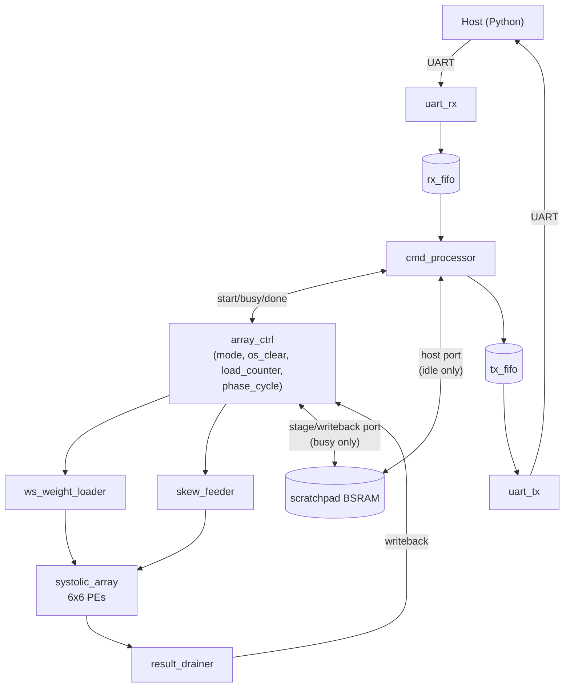
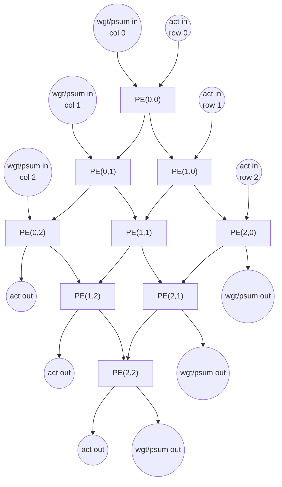
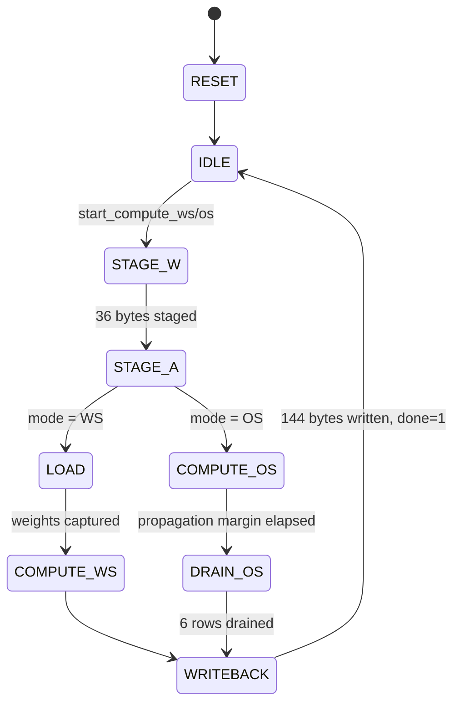

# Architecture

## Overview

A 6x6 systolic array of int8x8->int32 MAC processing elements (PEs),
switchable between two GEMM dataflows (weight-stationary and
output-stationary), fed from an on-chip BSRAM scratchpad, controlled
over a framed UART protocol from a Python host.

Port access to the scratchpad is time-muxed in `top.vhd`: the host
(`cmd_processor`) owns it while the array is idle, `array_ctrl`'s
stage/writeback datapath owns it while busy -- the two are never
active at the same time (`cmd_processor` NACKs host writes/reads with
`ERR_BUSY` while a compute is running).

## Dataflow modes

Both modes compute `C = A @ W` for 6x6 int8 matrices `A` (activations)
and `W` (weights), accumulating in int32, no saturation.

The PE grid only has neighbor-to-neighbor links: activations flow
west->east, weights/partial-sums flow north->south. A 3x3 excerpt of
the full 6x6 interconnect (the pattern repeats identically for all 36
PEs):

In `PE_LOAD_WEIGHT`/`PE_COMPUTE_OS` the vertical links carry weights;
in `PE_COMPUTE_WS`/`PE_DRAIN_OS` they carry partial sums/accumulator
values -- same wires, different meaning depending on `mode` (see
`rtl/pe/pe.vhd`).

### Weight-stationary (WS)

- **Load**: `W` is broadcast into the array from the north edge, one
  row of `W` per cycle, over `ARRAY_ROWS` cycles. Each PE's static
  `ROW` generic determines when it captures: because the array only
  has neighbor-to-neighbor links, a value fed at global cycle `t`
  reaches physical row `r` after `r` register hops (cycle `t+r`). PE
  row `r` holds `W[r][*]`, fed at `t=r`, so it arrives at cycle `2*r`
  -- that's the capture condition (`load_counter = 2*ROW`).
- **Compute**: activations stream west->east, skewed by row (`row k`
  fed with a `k`-cycle delay relative to row 0 -- same skew technique
  as OS, just applied to one operand instead of two). Partial sums
  flow north->south, each PE adding `act*weight_stat` to the incoming
  sum. Output `C(m,c)` becomes valid at `psum_south(c)` at local cycle
  `g = m + ARRAY_ROWS + c - 1` (empirically confirmed via simulation,
  see `sim/tb_systolic_array.vhd`).
- Both the load and compute cycle counts needed one more cycle than a
  naive count suggested -- confirmed by simulation catching the last
  row/column's output arriving one cycle later than initially assumed.

### Output-stationary (OS)

- Both operands stream in simultaneously, skewed by their own array
  position: row `i`'s activation feed starts `i` cycles late, column
  `j`'s weight feed starts `j` cycles late. Both operands for
  contraction index `t` then arrive at PE(i,j) at the same cycle
  `i+j+t`, by construction (classic Kung/Leiserson output-stationary
  skew). Each PE accumulates `act*wgt` locally every cycle it has
  valid data.
- One dedicated `os_clear` cycle zeroes every PE's accumulator before
  real data starts flowing (needed since the first cycle's fed data
  can't be distinguished from "just cleared" otherwise).
- The array needs a **propagation margin** after the last operand is
  fed: the last value for PE(ROWS-1,COLS-1) doesn't finish arriving
  and registering until `(ROWS-1)+(COLS-1)+(ROWS-1)+1` cycles after
  the feed window closes. Getting this wrong was a real bug caught by
  simulation (`tb_array_ctrl` failed on the "far" PEs specifically
  until the margin was added) -- see `rtl/array/array_ctrl.vhd`.
- **Drain**: each PE outputs its accumulator south while loading in
  whatever its north neighbor holds, turning each column into a
  6-deep shift register. One combinational read (row `ROWS-1`) plus
  `ROWS-1` shift edges reads out all 6 rows, bottom-to-top, in exactly
  `ARRAY_ROWS` cycles, all 6 columns in parallel.

### Array controller FSM

`STAGE_W`/`STAGE_A` and `WRITEBACK` are shared by both dataflows (see
"Staging / writeback" below); `LOAD`/`COMPUTE_WS` and
`COMPUTE_OS`/`DRAIN_OS` are mode-specific. `busy` is asserted for every
state except `IDLE`/`RESET`; `done` latches high in `WRITEBACK`'s last
cycle and clears again on the next `start_compute_*`.

### Staging / writeback

Neither dataflow can feed the array directly from the BSRAM scratchpad
during the hot loop: OS's steady state needs up to 6 different bytes
(one per row/column) in the same cycle, and WS's rolling output can
produce up to 6 results in the same cycle -- far more than a
single-port byte-wide BRAM can sustain. So `array_ctrl` adds two
bracketing phases:

- **STAGE_W / STAGE_A**: burst-copy the 36-byte weight/activation
  regions out of the scratchpad into `ws_weight_loader` / `skew_feeder`'s
  own local 36-byte register files (fast, arbitrary-access, no BRAM
  read latency) before compute starts.
- **WRITEBACK**: `result_drainer` captures every emerging result into
  its own local 36x32-bit register file during COMPUTE_WS/DRAIN_OS,
  then burst-writes all 144 bytes out to the scratchpad's result
  region afterward, one byte per cycle.

## Toolchain

Simulation uses GHDL directly (any install -- this repo's own dev
environment uses a standalone one, not bundled with anything else).
Synthesis/place&route/bitstream/programming go through Gowin's own EDA
(`gw_sh` headless Tcl shell + `programmer_cli`, no GUI) -- see
`docs/bringup.md` for why: the originally-planned fully open-source
flow (yosys+GHDL -> `nextpnr-himbaechel` -> apycula `gowin_pack` ->
`openFPGALoader`) reached bitstream successfully in an earlier session
but never got running end-to-end in this repo's actual Linux dev
environment, so Gowin's own free/Education-tier EDA is what's actually
in use now. Two toolchain-specific facts, confirmed empirically, not
assumed:

- Signed `a(7 downto 0) * b(7 downto 0)` in VHDL synthesizes to a
  `MULT9X9` Gowin DSP cell automatically -- but only if there is
  exactly **one** multiply expression per PE in the source. The first
  PE design had two separate `act_in * X` multiply expressions (one
  per compute-mode branch, functionally mutually exclusive but
  textually distinct), and synthesis instantiated a *separate* MULT9X9
  for each -- 72 total against a 40-cell device budget. Fixed by
  computing one shared `mult_result <= act_in * mult_b` signal and
  using it in both branches (see `rtl/pe/pe.vhd`).
- A VHDL array read/written inside a single clocked process with a
  registered read infers Gowin `DPB`/BSRAM cells reliably (confirmed:
  `rtl/mem/bram_sdp.vhd`'s pattern maps a 39936-byte array to exactly
  20 DPB cells, matching the planned memory map).

### Target device capacity (important finding)

The full design (36 PEs + 39KB scratchpad + UART/protocol stack)
synthesizes to roughly 11,000-14,000 LUT-equivalent cells and 36
MULT9X9 DSP cells. This **does not fit** a Tang Nano 9K (GW1N-9C,
8640 LUT4, 40 MULT9X9 max as 2x MULT9X9-per-MULT18X18) -- confirmed by
an actual `nextpnr-himbaechel` run reporting 166% LUT4 utilization.
Merging the PE's two 32-bit registers into one was tried as an area
optimization and **made LUT usage worse**, not better (a wider
next-state select mux for one register cost more than the two simpler
registers saved) -- reverted.

The project therefore targets the originally-intended **Tang Nano 20K**
(GW2AR-LV18QN88C8/I7, device family GW2A-18C), which has a substantially
larger fabric (20,736 LUT4) than the 9K. An earlier session mis-identified
this board's chip as GW1NSR-18C; GW2AR-LV18QN88C8/I7 is the real part
(cross-checked against Sipeed's own official example repo).
`scripts/build.sh` runs the current toolchain
(Gowin `gw_sh` -> synthesis -> P&R -> bitstream) end-to-end -- confirmed
empirically, and confirmed on real hardware, not just placement. See
`docs/bringup.md` for the toolchain history and hardware bring-up trail.

## Memory map

See `docs/memory_map.md`.

## Protocol

See `docs/protocol.md`.
