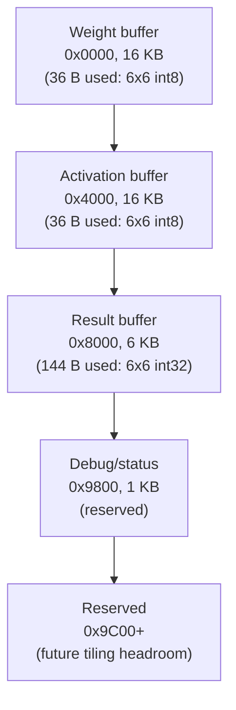

# Scratchpad Memory Map

Single BSRAM instance (`rtl/mem/scratchpad.vhd`, wrapping the generic
`rtl/mem/bram_sdp.vhd`), port-muxed in `top.vhd` between the host
(`cmd_processor`, while the array is idle) and the internal
stage/writeback datapath (`array_ctrl` + `result_drainer`, while the
array is busy) -- see `docs/architecture.md`. Single source of truth
is `rtl/common/pkg_memmap.vhd`; `python/fpga_systolic/protocol.py`
mirrors the base addresses.

Originally sized against the Tang Nano 9K's 26 x 18Kbit BSRAM budget
(~77% utilization, confirmed via synthesis: 20 DPB cells). The design
now targets the Tang Nano 20K, which has a much larger BSRAM budget,
so this sizing carries a comfortable margin rather than being tight.

| Region | Base (byte addr) | Size | v1 payload |
|---|---|---|---|
| Weight buffer | `0x0000` | 16 KB | 36 B (6x6 int8, row-major) at offset 0 |
| Activation buffer | `0x4000` | 16 KB | 36 B (6x6 int8, row-major) at offset 0 |
| Result buffer | `0x8000` | 6 KB | 144 B (6x6 int32, row-major) at offset 0 |
| Debug/status | `0x9800` | 1 KB | reserved for future use (debug readback currently goes through `DEBUG_READ_PE`'s live register access, not this region) |
| Reserved | `0x9C00`+ | remainder | headroom for a future tiling extension (v1 is fixed 6x6, no tiling) |

Each region is far larger than v1's actual per-matrix payload (36B/36B/144B)
deliberately, to leave room for a later extension that tiles larger
matrices into repeated 6x6 blocks without needing a memory map redesign.

**Tiling landed as a host-side-only feature** (`fpga-systolic tiled-run`,
`python/fpga_systolic/tiling.py`): each 6x6 tile is loaded, computed, and
read back before the next one is loaded, reusing offset 0 of each region
exactly like v1 does -- the reserved headroom above was never actually
needed and remains unused/available. Accumulation across tiles happens
in the host driver, not on-device, since the array has no
cross-invocation accumulator (see `docs/architecture.md`).
