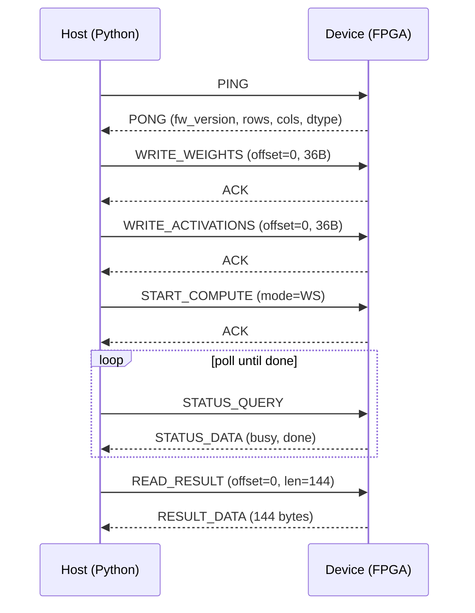
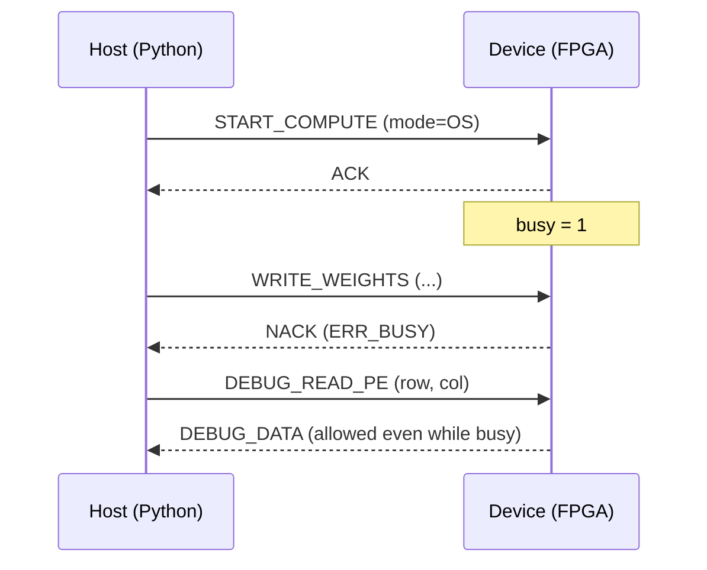

# UART Protocol

Single source of truth for the wire protocol. `rtl/common/pkg_protocol.vhd`
and `python/fpga_systolic/protocol.py` both implement this exactly --
if this document changes, update both (there's no code generation for
this yet; a small script is worth adding if the table grows).

Default baud: **1.5 MBaud** (27MHz / 18, an exact integer divisor --
0% clock error). 3 MBaud (divisor 9, also exact) is a possible stretch
target once the link is proven stable, matching the CH552 bridge's
reported ceiling; verify empirically during bring-up, don't assume.

## Frame format

Both host->device and device->host frames use the same shape:

```
[ SYNC 0xA5 ][ OPCODE 1B ][ LEN 1B ][ PAYLOAD (LEN bytes) ][ CRC8 1B ]
```

- `SYNC = 0xA5`: lets the receiver resync after any dropped/corrupted
  byte -- any byte that isn't SYNC while waiting for a frame start is
  silently dropped.
- `LEN`: payload byte count only (0-255), not including SYNC/OPCODE/LEN/CRC.
- `CRC8`: computed over `OPCODE || LEN || PAYLOAD` (**not** SYNC).
  Polynomial `0x07`, init `0x00`, MSB-first, no reflection. Chosen for
  simplicity given a short, low-noise, wired point-to-point link and
  small payloads (<=180 bytes); upgrading to CRC-16-CCITT later is a
  contained change (one constant on each side) if bring-up ever shows
  real-world corruption.
- On CRC mismatch, unknown opcode, or a truncated/timed-out frame: the
  device drops the frame and sends `NACK` with an error code, then
  returns to waiting for the next SYNC. No partial-frame recovery.

## Opcodes

### Host -> device

| Opcode | Name | Payload | Notes |
|---|---|---|---|
| 0x01 | `WRITE_WEIGHTS` | `OFFSET(2B,LE) DATA(N bytes)` | writes into the weight scratchpad region at `OFFSET`; `N = LEN-2` |
| 0x02 | `WRITE_ACTIVATIONS` | `OFFSET(2B,LE) DATA(N bytes)` | writes into the activation scratchpad region |
| 0x03 | `START_COMPUTE` | `MODE(1B) K(2B,LE)`: 0=WS/1=OS, K=contraction length | rejected (NACK BUSY) if not idle; NACK BAD_K if K=0 or K>OS_K_MAX |
| 0x04 | `READ_RESULT` | `OFFSET(2B,LE) LEN(1B)` | request; device replies with `RESULT_DATA` |
| 0x05 | `STATUS_QUERY` | (none) | device replies with `STATUS_DATA` |
| 0x06 | `DEBUG_READ_PE` | `ROW(1B) COL(1B)` | reads raw PE registers; allowed even while busy |
| 0x07 | `RESET` | (none) | soft reset of the array controller only, not the UART link |
| 0x08 | `PING` | (none) | device replies with `PONG` |

`WRITE_WEIGHTS`/`WRITE_ACTIVATIONS`/`START_COMPUTE`/`READ_RESULT` are
NACKed with `ERR_BUSY` while a compute is in progress, since the
scratchpad's ports belong to the internal stage/writeback datapath
during that time. `DEBUG_READ_PE`, `STATUS_QUERY`, `PING` and `RESET`
are always accepted (pure read-only / soft-control operations).

### Device -> host

| Opcode | Name | Payload |
|---|---|---|
| 0x81 | `ACK` | (none) |
| 0x82 | `NACK` | `ERR_CODE(1B)` |
| 0x83 | `RESULT_DATA` | `OFFSET(2B,LE) LEN(1B) DATA(LEN bytes)` |
| 0x84 | `STATUS_DATA` | `STATUS(1B)`: bit0=BUSY, bit1=DONE |
| 0x85 | `DEBUG_DATA` | `ROW(1B) COL(1B) WEIGHT(1B) ACCUM(4B,LE signed)` |
| 0x86 | `PONG` | `FW_VER(1B) ROWS(1B) COLS(1B) DTYPE_CODE(1B)` (DTYPE_CODE 0 = int8x8->int32) |

### NACK error codes (payload byte 0)

| Code | Name |
|---|---|
| 0x01 | `ERR_CRC_FAIL` |
| 0x02 | `ERR_BAD_OPCODE` |
| 0x03 | `ERR_BAD_LEN` (defined, not yet actively checked in v1) |
| 0x04 | `ERR_BUSY` |
| 0x05 | `ERR_BAD_ADDR` (defined, not yet actively checked in v1) |
| 0x06 | `ERR_TIMEOUT` (defined, not yet actively checked in v1) |
| 0x07 | `ERR_BAD_K` |

## Data format

int8 x int8 -> int32, no saturation. Output rows/cols (M, N) are always
fixed at 6 (the array's physical size), row-major. `RESULT_DATA` payloads
are always 36 int32 values, 4 bytes each, little-endian, two's complement
-- unaffected by K, since M and N never change.

`WRITE_WEIGHTS`/`WRITE_ACTIVATIONS` payload sizes depend on K:
- **WS mode**: K is always 6 (physically fixed -- see
  `docs/architecture.md`). Payloads are 36 raw int8 bytes, row-major.
- **OS mode**: K is the `START_COMPUTE` request's own field, 1..`OS_K_MAX`
  (16 -- see `rtl/common/pkg_types.vhd`). `WRITE_ACTIVATIONS` payload is
  `6*K` bytes, row-major M-major/K-minor (activations are 6xK).
  `WRITE_WEIGHTS` payload is `K*6` bytes, row-major K-major/N-minor
  (weights are Kx6). Both dense, no padding -- K itself is exactly what's
  sent, whatever `START_COMPUTE` will later declare for the same K.

A single hardware compute call cannot mix different K values between the
weight/activation writes and the `START_COMPUTE` that follows -- write
both matrices at the K you intend to compute with, then send that same K
in `START_COMPUTE`.

## Typical session



### Busy rejection

`WRITE_*`/`START_COMPUTE`/`READ_RESULT` sent while a compute is already
running are NACKed instead of queued or blocked:


